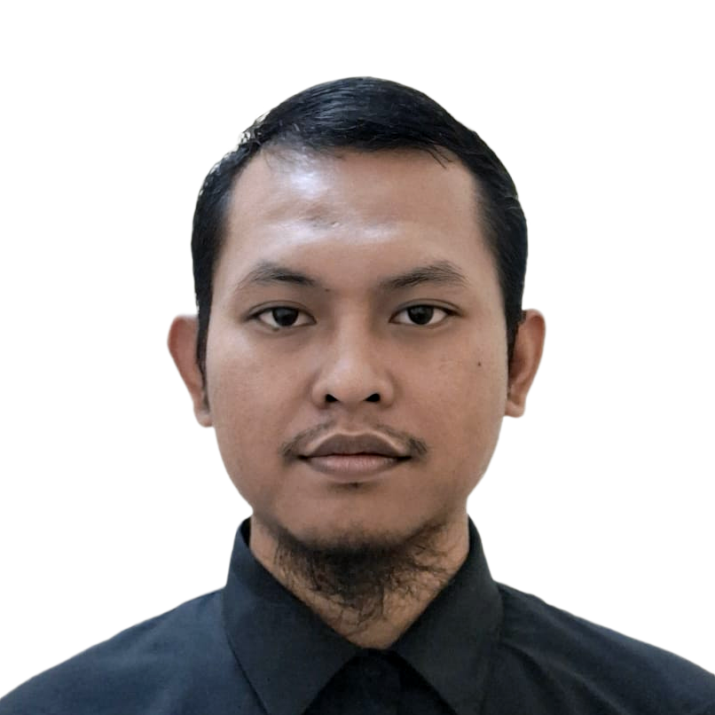

---

# Sugeng Hartono, M.Si., M.Sc.
Marine Biologist | Fisheries Genetics | Molecular Ecology | Lecturer
📍 Banjarnegara, Indonesia  
📧 sugeng.hartono@unsoed.ac.id  

🔗 **Profiles:**  
- 🌐 [Google Scholar](https://scholar.google.co.id/citations?user=GxbfcCEAAAAJ&hl)  
- 📊 [Scopus Author](https://www.scopus.com/authid/detail.uri?authorId=59229008800)  
- 📚 [Web of Science](https://www.webofscience.com/wos/author/record/LRS-8174-2024)  
- 🆔 [ORCID](https://orcid.org/0000-0002-2317-7648)  

---

## 👨‍🔬 About Me

I am a Marine Biologist and Lecturer at Jenderal Soedirman University with research expertise in fisheries biology, molecular identification, and marine resource management. My work integrates morphology, DNA barcoding (COI), and fisheries ecology to support sustainable fisheries management and biodiversity documentation in Indonesian waters.

My long-term research goal is to advance molecular-based fisheries assessment and biodiversity conservation in tropical marine ecosystems.

---

## 🎓 Education

**M.Sc. in Marine Biology (With Honors, GPA 4.92/5.00)**  
King Abdulaziz University, Saudi Arabia – 2024  

**M.Sc. in Coastal and Marine Resources Management (With Honors)**  
Bogor Agricultural University – 2020  

**B.Sc. in Fisheries (With Honors)**  
Bogor Agricultural University – 2017  

---

## 🔬 Research Interests

- DNA Barcoding & Molecular Identification  
- Population Genetics (K2P Distance, Phylogenetics)  
- Fisheries Biology (Growth, Reproduction, Feeding Ecology)  
- Fishery Resource Assessment  
- Marine Biodiversity Documentation  
- Sustainable Fisheries Management  

---

## 🧬 Current Research Projects (2025)

- Morphology and DNA-based identification of *Scomberoides* spp. in Cilacap Waters  
- Molecular and morphological analysis of Bombay duck (*Harpadon nehereus*)  
- DNA verification of Indian halibut in southern Java  

All projects aim to strengthen genetic documentation of economically important fish species in Indonesian waters.

---

## 📚 Selected International Publications

- Growth, Feed, and Food Habits of *Saurida tumbil* in Jizan Fisheries, Saudi Arabia (2024)  
- Effect of Modified Scoop Net Design and Optimal Fishing Time on Catch Weight (2024)  
- Effect of Fishing Time and Mesh Size on Gill Net Catches (2025)  
- First record of fish species in Cilacap Waters (GenBank Accession IDs reported, 2025)  

*(Full list available on Google Scholar)*

---

## 👨‍🏫 Academic Experience

**Lecturer – Aquatic Resources Management**  
Jenderal Soedirman University (2024–Present)

Courses:
- Fisheries Statistics  
- GIS  
- Genetics  
- Oceanography  
- Research Methods  

**Research Assistant**  
Marine Biology Department, King Abdulaziz University (2020–2024)

---

## 🛠 Technical Skills

**Molecular Tools**
- DNA Extraction & PCR  
- DNA Barcoding (COI)  
- Digital PCR  
- BLAST  
- Phylogenetic Analysis (MEGA)

**Data & Programming**
- R (PCA, statistical analysis)  
- GIS  
- FISAT II  
- ODV  
- Surfer  
- Marine Copernicus Data  

**Computational Platforms**
- Google Colab  
- Jupyter Notebook  
- Kaggle  

---

## 🤿 Certifications

- PADI Open Water Diver  
- DNA Barcoding Course – IPB University    
- Marine Data for Sustainable Oceans – Copernicus  
- Fundamentals of Deep Learning – NVIDIA  

---

## 🌍 Academic Service

- Editor Assistant – Journal of Aquaculture and Fish Health  
- Reviewer – Journal of Fisheries Science and Technology  

---

## 📬 Collaboration & PhD Opportunities

I am open to international research collaboration and PhD opportunities in:

- Fisheries Genetics  
- Molecular Ecology  
- Marine Biodiversity  
- Sustainable Fisheries Science  

## 🔗 Academic Profiles

